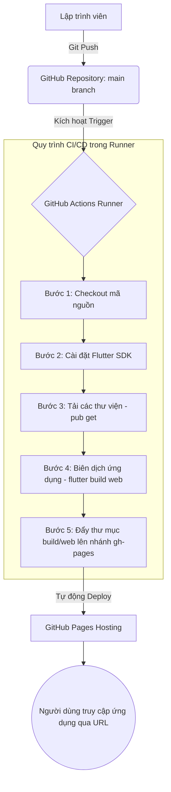
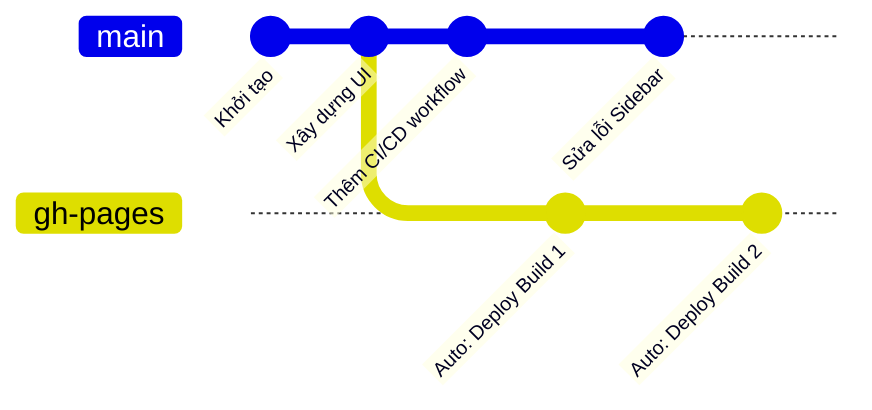

# Phân tích Cấu trúc & Quy trình Tự động Hóa Deploy Flutter Web lên GitHub Pages

Tài liệu này phân tích chi tiết cấu trúc tập tin cấu hình CI/CD và quy trình tự động hóa (Auto-deploy) của dự án `my_profile` khi triển khai lên **GitHub Pages** thông qua **GitHub Actions**.

---

## 1. Sơ đồ Kiến trúc Triển khai (Deployment Architecture)

Dưới đây là mô hình hoạt động của hệ thống từ khi lập trình viên đẩy mã nguồn mới lên cho tới khi ứng dụng web được cập nhật trực tuyến:



---

## 2. Chi tiết Luồng Dữ liệu & Nhánh Git (Git Branch Workflow)

Nhằm đảm bảo an toàn cho mã nguồn dự án, luồng deploy sử dụng cấu trúc tách biệt giữa **Mã nguồn (Source Code)** và **Sản phẩm Biên dịch (Production Build)**:

*   **Nhánh `main` (hoặc `master`):** Nơi chứa toàn bộ mã nguồn của ứng dụng Dart/Flutter, cấu trúc dự án, cấu hình và các tài nguyên gốc.
*   **Nhánh `gh-pages`:** Nhánh tự động được tạo ra bởi Action `peaceiris/actions-gh-pages`. Nhánh này **chỉ chứa** các tệp tĩnh đã biên dịch từ thư mục `/build/web` (như `index.html`, `main.dart.js`, các assets ảnh, fonts...) phục vụ trực tiếp cho web server của GitHub Pages.



---

## 3. Phân tích Chi tiết Tập tin Cấu hình `flutter_web_deploy.yml`

Tập tin nằm tại thư mục [flutter_web_deploy.yml](file:///Users/phamngocthang/IdeaProjects/my_profile/.github/workflows/flutter_web_deploy.yml). Dưới đây là phân tích chức năng của từng thành phần:

| Thành phần cấu hình | Loại phần tử | Ý nghĩa & Chức năng cụ thể |
| :--- | :--- | :--- |
| `name: Deploy Flutter Web...` | Khai báo tên | Tên hiển thị của Workflow trên giao diện quản lý GitHub Actions. |
| `on: push: branches: [main]` | Điều kiện kích hoạt | Workflow sẽ tự động chạy **mỗi khi có hành động `push` hoặc gộp mã nguồn (PR merge) vào nhánh `main`**. |
| `runs-on: ubuntu-latest` | Môi trường ảo | Khởi tạo máy ảo chạy hệ điều hành Ubuntu mới nhất để thực hiện các câu lệnh biên dịch. |
| `actions/checkout@v3` | Action trợ giúp | Tải toàn bộ mã nguồn từ GitHub Repository về không gian làm việc của máy ảo để sẵn sàng build. |
| `subosito/flutter-action@v2` | Action trợ giúp | Thiết lập và định cấu hình môi trường Flutter SDK trên máy ảo (có thể chỉ định phiên bản cụ thể). |
| `flutter config --enable-web` | Lệnh Shell | Bật cấu hình hỗ trợ nền tảng Web cho Flutter trong môi trường máy ảo. |
| `flutter pub get` | Lệnh Shell | Tải xuống tất cả các gói phụ thuộc (packages) được cấu hình trong `pubspec.yaml`. |
| `flutter build web --release --base-href="/my_profile/"` | Lệnh Shell | Biên dịch mã nguồn Dart sang mã Web tối ưu (HTML, JS, CSS). Tham số `--base-href` cực kỳ quan trọng để đảm bảo đường dẫn tài nguyên đúng khi chạy trên thư mục con của GitHub Pages (`https://<username>.github.io/my_profile/`). |
| `peaceiris/actions-gh-pages@v3` | Action deploy | Nhận thư mục đầu ra `./build/web` và tự động đẩy đè/cập nhật vào nhánh `gh-pages` một cách an toàn thông qua `GITHUB_TOKEN`. |

---

## 4. Khuyến nghị Nâng cấp & Tối ưu hóa (Best Practices)

Để workflow hoạt động ổn định và nhanh hơn, dưới đây là một số đề xuất nâng cấp:

1.  **Nâng cấp phiên bản Actions:**
    *   Thay thế `actions/checkout@v3` bằng `@v4` để sử dụng Node 20 mới hơn, tránh các cảnh báo lỗi thời từ GitHub.
    *   Thay thế `peaceiris/actions-gh-pages@v3` bằng `@v4`.
2.  **Sử dụng Bộ nhớ đệm (Caching):**
    *   Kích hoạt cơ chế cache cho Flutter pub dependencies để rút ngắn thời gian chạy CI/CD từ ~5 phút xuống chỉ còn ~2 phút.

### Cấu hình đề xuất tối ưu (`flutter_web_deploy.yml` cải tiến):

```yaml
name: Deploy Flutter Web to GitHub Pages

on:
  push:
    branches:
      - main

jobs:
  build:
    name: Build and Deploy
    runs-on: ubuntu-latest

    steps:
      - name: Checkout repo
        uses: actions/checkout@v4

      - name: Set up Flutter
        uses: subosito/flutter-action@v2
        with:
          flutter-version: '3.44.0' # Đồng bộ với phiên bản Flutter hiện tại của máy bạn
          cache: true               # Bật bộ nhớ đệm tự động cho pub và SDK

      - name: Enable web
        run: flutter config --enable-web

      - name: Install dependencies
        run: flutter pub get

      - name: Build Web
        run: flutter build web --release --base-href="/my_profile/"

      - name: Deploy to GitHub Pages
        uses: peaceiris/actions-gh-pages@v4
        with:
          github_token: ${{ secrets.GITHUB_TOKEN }}
          publish_dir: ./build/web
```
